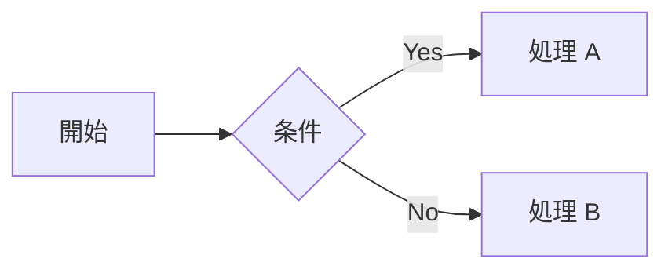

# CLAUDE.md

本ファイルは Claude Code 向けのプロジェクト指示書である。Marp スライドのテンプレートを編集する際の前提知識と、編集後に必ず通すべき lint / fix 手順をまとめる。

## プロジェクト概要

- Marp ベースのスライドテンプレート。テーマは [nord-marp-theme](https://github.com/ansanloms/nord-marp-theme) を継承し、`assets/styles/custom.css` で上書きする。
- ランタイムは Deno。`deno.json` の `tasks` に主要コマンドを集約している。
- 編集対象の Markdown は原則 `slides.md` のみ。

## Marp Markdown の書きかた

### Front Matter (Global Directives)

ファイル先頭に YAML front matter を置く。本テンプレートでは次の 3 つを既定値とする。

```yaml
---
lang: ja
title: スライドタイトル
author: 著者名
---
```

追加で利用できる代表的な Global Directive を示す。詳細は [Marpit Directives](https://marpit.marp.app/directives) を参照する。

| Directive  | 用途                                                       |
| ---------- | ---------------------------------------------------------- |
| `theme`    | 適用テーマ名 (本テンプレートは `marp.config.mjs` で固定)。 |
| `paginate` | ページ番号表示の有無 (`true` / `false`)。                  |
| `header`   | 全スライド共通のヘッダ文字列。                             |
| `footer`   | 全スライド共通のフッタ文字列。                             |
| `class`    | 全スライドに付与する CSS クラス。                          |
| `size`     | スライドサイズ (`16:9` / `4:3` / 任意の `WxH`)。           |
| `math`     | 数式エンジン (本テンプレートは KaTeX を有効化済み)。       |

### スライド区切り

`---` (前後を空行で囲んだ水平線) でスライドを区切る。最初の `---` 以前は front matter として解釈されるため、最初のスライドの直前には区切りを書かない。

### Local Directive (スライド単位)

特定のスライドだけ設定を変える場合は `_` プレフィックス付きの directive をスライド先頭のコメントに書く。

```markdown
<!-- _class: lead -->
<!-- _paginate: false -->
<!-- _backgroundColor: #2e3440 -->
<!-- _color: #eceff4 -->

# タイトルスライド
```

### 画像のサイズと配置

Marp 固有の image syntax で寸法と配置を指定できる。

| 記法                                | 意味                          |
| ----------------------------------- | ----------------------------- |
| ``                    | 幅を 400px に指定する。       |
| ``                    | 高さを 300px に指定する。     |
| ``              | 幅・高さを同時に指定する。    |
| ``                       | 背景画像として配置する。      |
| ``              | 左 33% を背景画像領域とする。 |
| `` / `` | フィット / カバー指定。       |

注意: 本テンプレートでは `marp.config.mjs` の `md.renderer.rules.image` 上書きで画像をビルド時に base64 data URI へ埋め込んでいる。これにより HTML 出力に画像が同梱されるが、`` 経由でないと埋め込みが効かない (CSS の `background-image:` や marp の `bg` directive は素のパス参照のまま) ため、PDF や PPTX 出力時の挙動を確認したうえで採用すること。

### コードブロックのハイライト

shiki (Nord テーマ) で着色する。言語識別子は通常通り fence の直後に書く。

````markdown
```javascript
const sayHello = (name) => console.log(`Hello ${name}`);
```
````

加えて `@shikijs/transformers` の transformer 3 種を有効化している。装飾用 CSS は `@ansanloms/nord-marp-theme` 側 (`pre code > .line` および `pre.has-focused` 起点) に集約されている。

| 機能         | 記法                                  | transformer                    | 付与クラス                                |
| ------------ | ------------------------------------- | ------------------------------ | ----------------------------------------- |
| 行ハイライト | `` ```js {2,4-5} ``                   | `transformerMetaHighlight`     | `.highlighted`                            |
| 語ハイライト | `` ```js /word/ ``                    | `transformerMetaWordHighlight` | `.highlighted-word`                       |
| 行フォーカス | コード内コメントに `// [!code focus]` | `transformerNotationFocus`     | `.focused` (親 `<pre>` に `.has-focused`) |

行ハイライト例を示す。

````markdown
```javascript {2,4-5}
const a = 1;
const b = 2;
const c = 3;
const d = 4;
const e = 5;
```
````

語ハイライト例を示す。

````markdown
```javascript /sayHello/
const sayHello = (name) => console.log(`Hello ${name}`);
sayHello("John");
```
````

行フォーカス例を示す。フォーカス外の行は透過とぼかしで弱められる。

````markdown
```javascript
const a = 1;
const b = 2;
const c = a + b; // [!code focus]
console.log(c);
```
````

注意: インラインコード (バックティック 1 つ) のハイライトは `@shikijs/markdown-it` がサポートしていない (rehype 版の `inline: 'tailing-curly-colon'` 相当は markdown-it 版に存在しない)。インラインコードは Marp テーマ標準の装飾のみが当たる。

### GitHub 風アラート

`> [!NOTE]` 等の記法をサポートする。利用できる種類は `NOTE` / `TIP` / `IMPORTANT` / `WARNING` / `CAUTION` である。

```markdown
> [!NOTE]
> 補足情報をここに書く。
```

### タスクリスト

`markdown-it-task-lists` で GFM のチェックボックス記法を `<input type="checkbox">` として描画する。装飾は `@ansanloms/nord-marp-theme` 側 (`li:has(> input[type=checkbox])` 起点) に集約されている。

```markdown
- [x] 完了したタスク
- [ ] 未完了のタスク
  - [x] ネストした完了タスク
  - [ ] ネストした未完了タスク
```

### 脚注

`markdown-it-footnote` で `[^N]` 構文の脚注をサポートする。`markdown-it-footnote` は標準ではドキュメント末尾に脚注を集約するが、本テンプレートでは `plugins/markdown-it-footnote-per-slide.mjs` でスライド単位に再配置している。

- 同じスライド内の脚注は、そのスライド末尾 (`<section class="footnotes">`) に固まる。
- 同じ脚注 id が複数スライドで参照される場合は、最初に登場するスライドにのみ配置する (HTML id 衝突を避けるため)。
- 本文の参照番号 `[N]` と脚注リストの `<ol>` 番号は `<ol start="N">` で一致させる。

```markdown
本文に脚注を挿入する[^1]。複数の脚注[^2] も同じスライド内で書ける。

[^1]: 1 つ目の脚注。

[^2]: 2 つ目の脚注。
```

### 数式 (KaTeX)

marp-core が標準で KaTeX を載せている。

- インライン: `$E = mc^2$`
- ディスプレイ: `$$ ... $$`

### 引用元クレジット (`quote` フェンス)

`` ```quote `` ブロックの中身は markdown-it のインラインパスで再パースされ、`<div class="quote">` で wrap される。引用元 URL を末尾に小さく添える用途を想定しており、`assets/styles/custom.css` の `.quote` で右寄せ・斜体・「―――」プレフィックスが当たる。

インラインパスを使うため、リンク (`[text](url)`) ・強調 (`**`, `_`) ・インラインコード (`` ` ` ``) ・`<kbd>` 等は生きるが、段落・リスト・コードブロックなどブロック要素は解釈されない。

````markdown
```quote
[サンプル書名](https://example.com) より
```
````

注意: `md.render` ではなく `md.renderInline` を使う実装である (`marp.config.mjs` の `quote` fence ハンドラ)。`md.render` を呼ぶと Marpit の `render` が走ってスライド分割系の出力が混入し、HTML が破綻する。同じ理由で `<p>` も生成されず、`p::before` の字下げが `.quote` 内に入り込まない。

### Mermaid 図

`` ```mermaid `` ブロックを書くと、ビルド後の HTML に注入されたブラウザ側スクリプト (`assets/scripts/mermaid.mjs`) が描画する。

````markdown

````

## ビルド

`deno.json` の tasks で実行する。

| コマンド                | 出力                       |
| ----------------------- | -------------------------- |
| `deno task build:html`  | `dist/slides.html`         |
| `deno task build:pdf`   | `dist/slides.pdf`          |
| `deno task build:pptx`  | `dist/slides.pptx`         |
| `deno task build:image` | `dist/png/slide.*.png`     |
| `deno task build`       | 上記すべてを順次実行する。 |

## lint / fix

編集後は必ず lint を通す。lint は 3 種類で構成される。

| コマンド                  | 内容                                |
| ------------------------- | ----------------------------------- |
| `deno task lint:deno`     | `deno lint` と `deno fmt --check`。 |
| `deno task lint:textlint` | textlint による日本語校正。         |
| `deno task lint`          | 上記すべてを順次実行する。          |

自動修正は fix 系タスクで行う。

| コマンド                 | 内容                                                         |
| ------------------------ | ------------------------------------------------------------ |
| `deno task fix:deno`     | `deno lint --fix` と `deno fmt`。                            |
| `deno task fix:textlint` | textlint の `--fix`。                                        |
| `deno task fix`          | fix 系をすべて実行し、最後に `deno task lint` で再検証する。 |

通常は `deno task fix` を一発で実行すればよい。fix で解消できない警告はファイルを直接修正する。

## 編集時のチェックリスト

1. `slides.md` を編集する。
2. 画像を追加する場合は `assets/images/` 配下に置き、`` で参照する。
3. `deno task fix` を実行し、自動修正後の lint 警告を解消する。
4. レイアウト変更時は `deno task build:html` でブラウザに `dist/slides.html` を表示し、見た目を確認する。
