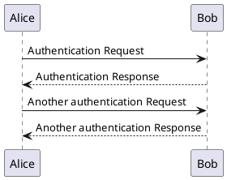

# Presentation Sample

---

# Heading 1 (title)

## Heading 2

Lorem ipsum dolor sit amet, consectetur adipiscing elit, sed do eiusmod tempor incididunt ut labore et dolore magna aliqua.

Ut enim ad minim veniam, quis nostrud exercitation ullamco laboris nisi ut aliquip ex ea commodo consequat.

### Heading 3

**This is bold text.**

_This is italic text._

---

# List

- Lorem ipsum dolor sit amet
- Consectetur adipiscing elit
  - Integer molestie lorem at massa

1. Lorem ipsum dolor sit amet
2. Consectetur adipiscing elit
3. Integer molestie lorem at massa

---

# Table

| Option | Description                     |
| ------ | ------------------------------- |
| hoge   | Lorem ipsum dolor sit amet      |
| fuga   | Consectetur adipiscing elit     |
| piyo   | Integer molestie lorem at massa |

---

# Code

This is `inline code` .

```javascript
const sayHello = (name) => {
  console.log(`Hello ${name}`.);
}

sayHello("John");
```

---

# Image


<https://rnavi.ndl.go.jp/imagebank/index.html>

---


# Image - background

``

---


# Image - background split

``

---

# Note

::: note tip

### Tip

tip.
:::

::: note info

### Info

info.
:::

::: note warning

### Warning

warning.
:::

::: note danger

### Danger

danger
:::

---

# PlantUML


