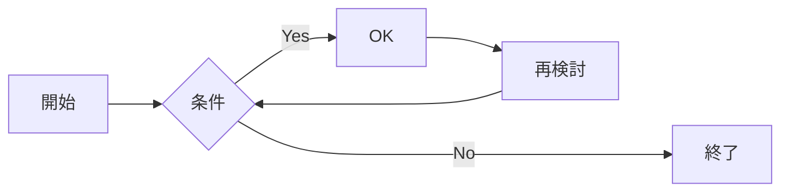
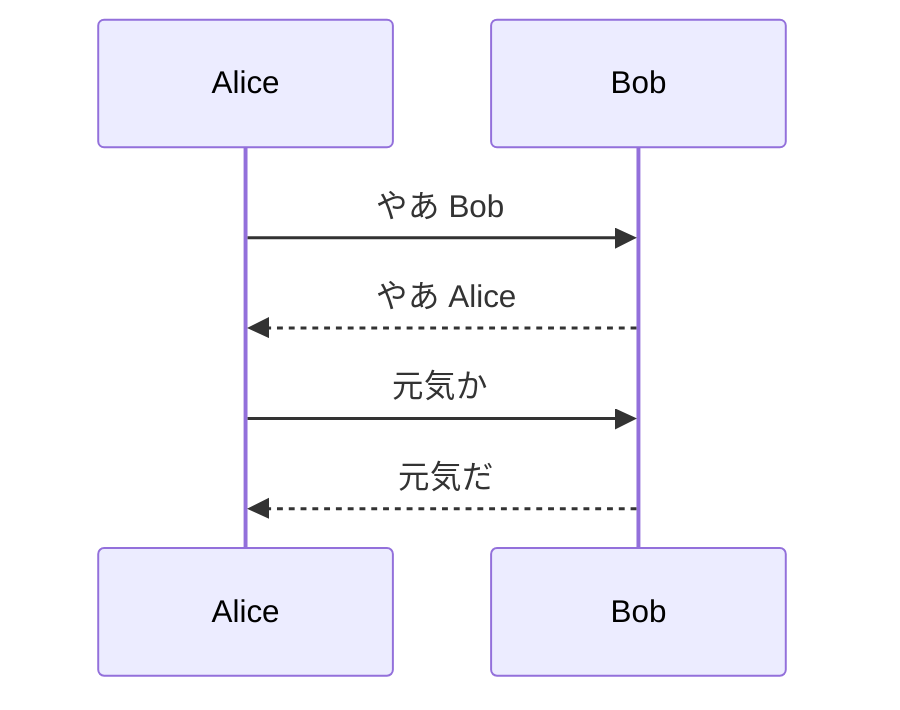
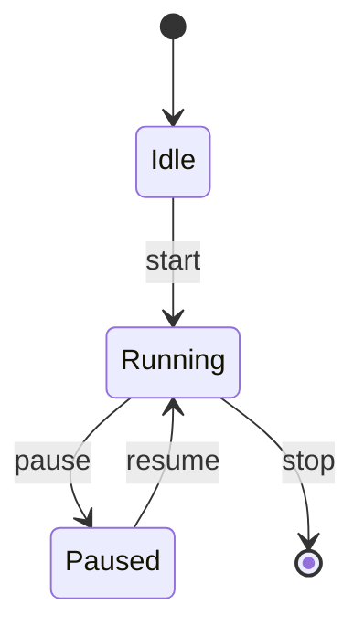
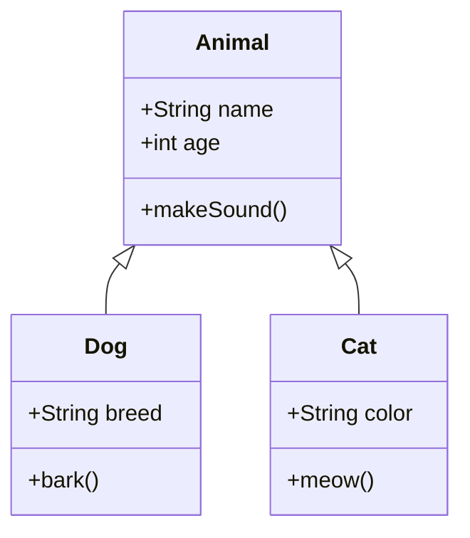

# Marp スライドテンプレート

[Nord](https://www.nordtheme.com/) 配色を採用した [Marp](https://marp.app/) のスライドテンプレートである。

---

# 見出しレベルの例

## 第 2 階層の見出し

### 第 3 階層の見出し

#### 第 4 階層の見出し

##### 第 5 階層の見出し

###### 第 6 階層の見出し

---

# 見出しと本文

## 章タイトル

第 2 階層の見出しに続く本文である。テンプレートの体裁を確認するための文章を配置している。

### 節タイトル

第 3 階層の見出しに続く本文である。暗い背景でも見出しと本文の階調が崩れないかを確認する。

#### 項タイトル

第 4 階層の見出しに続く本文である。

---

# 段落

最初の段落である。Marp は通常の Markdown と同様に空行で段落を区切る。長文を入れた場合の改行や行間が崩れないかをここで確認する。

2 つめの段落である。テーマや CSS の変更後はこの段落の見た目を見比べると差分が分かりやすい。

**ここは太字である。**

_ここは斜体である。_

---

# インライン要素

段落のなかに [ハイパーリンク](https://www.nordtheme.com/) と `インラインコード` と **太字** と _斜体_ と ~~取り消し線~~ とキーボードショートカット <kbd>Ctrl</kbd> + <kbd>C</kbd> を混在させた例である。

別の行として [Nord 公式ドキュメント](https://www.nordtheme.com/docs) へのリンクと `deno task build` の表記を含めた例も示す。

---

# 引用

> 引用のサンプルである。
>
>> 入れ子の引用である。

---

# 引用元クレジット (`quote` フェンス)

引用元の URL を末尾に小さく添えるためのカスタムフェンスである。中身は Markdown のインライン要素として解釈し、`<div class="quote">` で wrap する。

```quote
[サンプル書名](https://example.com) より
```

---

# 箇条書きと番号付きリスト

- 順序のない項目その 1
- 順序のない項目その 2
  - 入れ子の項目
- 順序のない項目その 3

1. 順序付きの項目その 1
2. 順序付きの項目その 2
3. 順序付きの項目その 3

---

# タスクリストと水平線

- [x] 完了したタスク
- [x] もう 1 つの完了したタスク
- [ ] 未完了のタスク
- [ ] 着手前のタスク
  - [x] 入れ子の完了タスク
  - [ ] 入れ子の未完了タスク

水平線の上に置いた文である。

<hr>

水平線 (`<hr>`) の下に置いた文である。1 枚のスライドに収まる。

---

## 表

| 項目 | 説明                 |
| ---- | -------------------- |
| hoge | ダミーの説明文その 1 |
| fuga | ダミーの説明文その 2 |
| piyo | ダミーの説明文その 3 |

---

# 画像


---

# コードブロック

`インラインコード` の見え方の確認である。

```javascript
const sayHello = (name) => {
  console.log(`Hello ${name}`);
};

sayHello("John");
```

---

# 数式 (KaTeX)

インライン数式は $E = mc^2$ および $\sum_{i=1}^{n} i = \frac{n(n+1)}{2}$ のように記述する。

ディスプレイ数式は次のように記述する。

$$
\int_{-\infty}^{\infty} e^{-x^2} \, dx = \sqrt{\pi}
$$

$$
A = \begin{pmatrix} a & b \\\\ c & d \end{pmatrix}
$$

---

# シンタックスハイライト ([Shiki](https://shiki.style/))

```javascript
// marp.config.mjs

import { defineConfig } from "@marp-team/marp-cli";
import Shiki from "@shikijs/markdown-it";

export default defineConfig({
  engine: async ({ marp }) => {
    marp.use(await Shiki({ theme: "nord" }));

    return marp;
  },
});
```

---

# Shiki: 行ハイライト (`{n}` 記法)

fence の言語指定の後ろに `{2,4-5}` のように行番号を書くと、その行が `.highlighted` クラスで装飾される (`transformerMetaHighlight`)。

```javascript {2,4-5}
const a = 1;
const b = 2; // この行がハイライトされる
const c = 3;
const d = 4; // ここから
const e = 5; // ここまでハイライト
```

---

# Shiki: 語ハイライト (`/word/` 記法)

fence の言語指定の後ろに `/sayHello/` のように単語を書くと、その単語が `.highlighted-word` クラスで装飾される (`transformerMetaWordHighlight`)。

```javascript /sayHello/
const sayHello = (name) => {
  console.log(`Hello ${name}`);
};

sayHello("John");
```

---

# Shiki: 行フォーカス (`[!code focus]` 記法)

コード内コメントに `// [!code focus]` を書くと、その行に `.focused` クラスが付き、それ以外の行は `.has-focused` の装飾 (透過 + ぼかし) で弱められる (`transformerNotationFocus`)。

```javascript
const a = 1;
const b = 2;
const c = a + b; // [!code focus]
console.log(c);
```

---

# GitHub 風アラート

```javascript
// marp.config.mjs

import { defineConfig } from "@marp-team/marp-cli";
import MarkdownItGitHubAlerts from "markdown-it-github-alerts";

export default defineConfig({
  engine: async ({ marp }) => {
    marp.use(MarkdownItGitHubAlerts);

    return marp;
  },
});
```

---

> [!NOTE]
> 流し読みでも見逃したくない補足情報をここに置く。

> [!TIP]
> よりうまく使うための任意の情報をここに置く。

> [!IMPORTANT]
> 成功に不可欠な重要情報をここに置く。

---

> [!WARNING]
> 即時の注意を要する内容をここに置く。

> [!CAUTION]
> 実施した場合の負の結果をここに置く。

---

# Mermaid: フローチャート


```mermaid
flowchart LR
    A[開始] --> B{条件}
    B -->|Yes| C[OK]
    C --> D[再検討]
    D --> B
    B ---->|No| E[終了]
```

---

# Mermaid: シーケンス図


```mermaid
sequenceDiagram
    Alice->>Bob: やあ Bob
    Bob-->>Alice: やあ Alice
    Alice->>Bob: 元気か
    Bob-->>Alice: 元気だ
```

---

# Mermaid: 状態遷移図


```mermaid
stateDiagram-v2
    [*] --> Idle
    Idle --> Running: start
    Running --> Paused: pause
    Paused --> Running: resume
    Running --> [*]: stop
```

---

# Mermaid: クラス図


```mermaid
classDiagram
    class Animal {
        +String name
        +int age
        +makeSound()
    }
    class Dog {
        +String breed
        +bark()
    }
    class Cat {
        +String color
        +meow()
    }
    Animal <|-- Dog
    Animal <|-- Cat
```

---

# 記述例

## レガシーなプロジェクトとは

保守もしくは拡張が困難な既存プロジェクト。

- 古い
- 大きい
- 引き継がれている
- ドキュメントが不十分

```quote
[レガシーソフトウェア改善ガイド](https://www.shoeisha.co.jp/book/detail/9784798145143) p4-5
```
